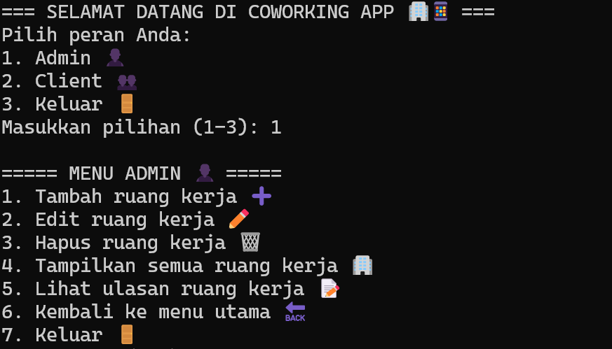

# 🏢 Aplikasi Manajemen & Review Co-Working Space

Aplikasi berbasis **Golang** untuk mengelola dan mencari co-working space berdasarkan fasilitas, lokasi, harga, dan ulasan pengguna.



## 📌 Deskripsi
Aplikasi ini ditujukan untuk:
- **Pemilik co-working space**: mengelola informasi tempatnya.
- **Client**: mencari tempat kerja yang sesuai dan memberikan ulasan.

## ✨ Fitur
- CRUD data co-working space: nama, lokasi, fasilitas, harga sewa.
- CRUD ulasan dan rating pengguna.
- Pencarian co-working space berdasarkan nama/lokasi:
  - ✅ Sequential Search  
  - ✅ Binary Search
- Pengurutan berdasarkan:
  - 💰 Harga sewa
  - ⭐ Rating tertinggi  
  Menggunakan:
  - ✅ Selection Sort  
  - ✅ Insertion Sort
- Filter co-working space berdasarkan fasilitas (WiFi, meeting room, private desk, dll).

## 🛠️ Teknologi
- Bahasa Pemrograman: **Go (Golang)**
- Algoritma: Implementasi manual untuk **search** dan **sort**

## 🚀 Cara Menjalankan
```bash
go run main.go
